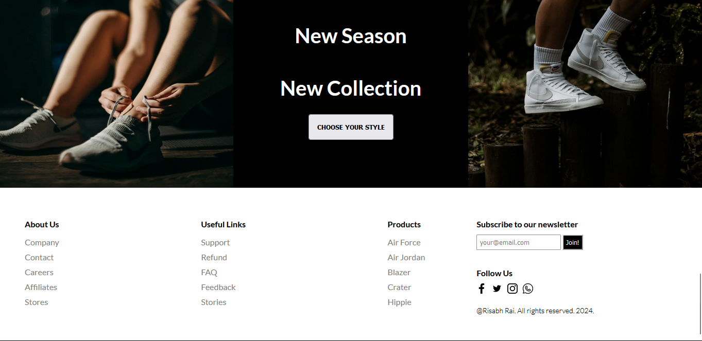
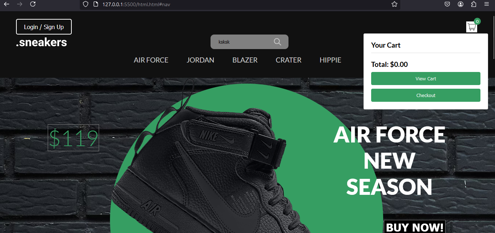

# Sneaker E-Commerce Website

Welcome to the Sneaker E-Commerce Website! This platform allows users to browse and purchase a wide range of athletic footwear effortlessly. Our site provides a seamless shopping experience with various features for product discovery, secure transactions, and order management.

## Features

- **Product Listings**: Browse a diverse selection of sneakers with detailed descriptions and high-resolution images.
- **Search and Filters**: Quickly find your preferred sneakers using search and filtering options.
- **Secure Payment**: Enjoy secure and reliable payment options.
- **Personalized Recommendations**: Get product recommendations based on your preferences and browsing history.

## Screenshots

Here are some screenshots of the website:


*Homepage of the Sneaker E-Commerce Website*


*About Us Section*


*Shopping Cart*

## Screen Recording

Watch the screen recording of the website:

[Download or view the video](https://github.com/Ryshup/Sneaker/raw/main/sneakermp.mp4)

## Running the Prototype

To run the prototype of this website locally, follow these instructions:

### Prerequisites

No special software is required to run this website. All you need is a modern web browser (e.g., Google Chrome, Mozilla Firefox, Safari).

### Steps to Run the Website

1. **Clone the Repository:**
   ```bash
   git clone https://github.com/Ryshup/Sneaker.git


## Contributing

Contributions are welcome! Please fork the repository and submit a pull request with your changes.


Thank you for checking out our Sneaker E-Commerce Website!
